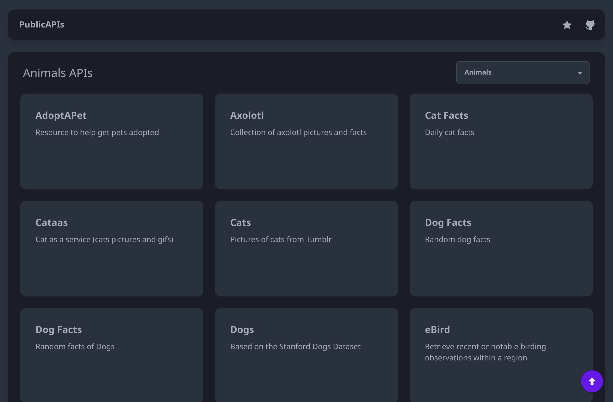

Before starting ✋. I want to tell you that every star 🌟 added to my space shines my world and motivate me 💪 to make more awesome things like this one so please don't forget to give me a star and like the project.

A simple UI implemention for the [Public Apis](https://github.com/public-apis/public-apis)
was made using [Svelte](https://svelte.dev/), [Tailwind](https://tailwindcss.com/), [DaisyUI](https://daisyui.com/).
